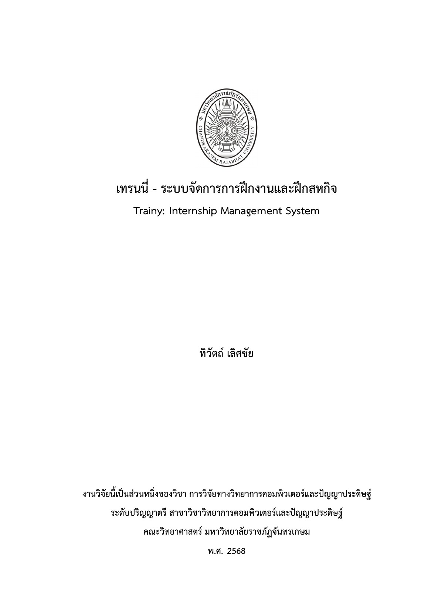

# CRU LaTeX Research Template

แม่แบบ LaTeX สำหรับจัดทำงานวิจัยระดับปริญญาตรี สาขาวิชาวิทยาการคอมพิวเตอร์และปัญญาประดิษฐ์ คณะวิทยาศาสตร์ มหาวิทยาลัยราชภัฏจันทรเกษม รองรับภาษาไทยด้วย XeLaTeX และฟอนต์ TH Sarabun New ที่เก็บไว้ในโครงการ

เพราะความขี้เกียจมันครอบงำ เราเลยต้องหาทางที่ดีกว่าในการทำวิจัย

## ทำไมถึงมีสิ่งนี้ออกมา

เอาตรงๆ คือ ขี้เกียจเขียนเล่มครับผม ถ้าเรารู้ว่าเราจะทำรายงานที่มันเขียนเยอะมากๆ แล้วปัญหาคือ
*"การจัดหน้า และแบบฟอร์มไม่เหมือนกันสักอันเดียว"* โดยได้ไอเดียนี้มาจากหลายมหาวิทยาลัยดังที่มีการใช้งาน LaTeX
ซึ่งคิดว่ามันน่าจะดีมากๆ เลย ถ้าเราเอามาแทน MS Word ในการเขียนวิจัย และง่ายต่อการที่เราจะเอาไป Integrated กับ
AI Agent ได้ง่ายยิ่งขึ้น

เอาจริงๆ อยากจะทำให้ง่ายยิ่งขึ้น แต่ว่าต้องหาเวลาพัฒนาด้วย ผมเลยคิดว่า *"ถ้าเราทำเหมือนต้นแบบขึ้นมาก่อน แล้วปล่อยให้ได้ลองใช้งาน ผมว่ามันก็ดีไม่น้อยเลยที่จะได้เห็นอะไรหลายอย่างจากผู้ใช้เหมือนกันที่ได้ลองอะไรแบบนี้ด้วย"*

## เริ่มใช้งานอย่างรวดเร็ว

สิ่งที่ต้องติดตั้งมีเพียง Docker Desktop หรือ Docker Engine พร้อม Docker Compose จากนั้นทำตามลำดับนี้

1. แก้ข้อมูลชื่อเรื่อง ผู้วิจัย และอาจารย์ใน `config/document-info.tex`
2. เขียนเนื้อหาใน `front-matter/`, `chapters/` และ `back-matter/`
3. คอมไพล์เอกสาร

สำหรับ Docker Compose แบบ standalone:

```bash
docker-compose run --rm latex
```

สำหรับ Docker Compose plugin รุ่นใหม่:

```bash
docker compose run --rm latex
```

เมื่อสำเร็จจะได้ `main.pdf` ที่โฟลเดอร์หลักของโครงการ

## ตัวอย่างเอกสาร

ดาวน์โหลดตัวอย่างที่คอมไพล์แล้วได้จาก [examples/example-thesis.pdf](examples/example-thesis.pdf)



ไฟล์ตัวอย่างสร้างจากค่าเริ่มต้นของแม่แบบ จึงใช้ตรวจรูปแบบหน้าปก หน้าอนุมัติ
สารบัญ เนื้อหาบท ตาราง บรรณานุกรม และภาคผนวกก่อนเริ่มแก้ข้อมูลจริงได้
เมื่อปรับแม่แบบ ควรคอมไพล์ `main.pdf` และสร้างไฟล์ตัวอย่างใหม่เพื่อให้ภาพใน
README ตรงกับผลลัพธ์ล่าสุดเสมอ

## โครงสร้างโครงการ

```text
.
├── config/
│   ├── document-info.tex       ข้อมูลที่ผู้ใช้แก้เป็นหลัก
│   └── layout.tex              รูปแบบกระดาษ ฟอนต์ หัวข้อ และเลขหน้า
├── front-matter/
│   ├── title-page.tex          หน้าปก
│   ├── approval-page.tex       หน้าอนุมัติและช่องลงนาม
│   ├── abstract-th.tex         บทคัดย่อภาษาไทย
│   ├── abstract-en.tex         บทคัดย่อภาษาอังกฤษ
│   └── acknowledgements.tex    กิตติกรรมประกาศ
├── chapters/
│   ├── 1_introduction.tex
│   ├── 2_literature-review.tex
│   ├── 3_methodology.tex
│   ├── 4_results.tex
│   └── 5_conclusion.tex
├── back-matter/
│   ├── references.tex          บรรณานุกรม
│   └── appendix-a.tex          ภาคผนวก ก
├── figures/                    รูปภาพ แผนภูมิ และแผนภาพ
├── fonts/                      ฟอนต์ TH Sarabun New
├── logo/                       ตรามหาวิทยาลัย
├── examples/
│   ├── example-thesis.pdf      ตัวอย่างเอกสารที่คอมไพล์แล้ว
│   └── preview/                ภาพตัวอย่างสำหรับ README
├── Dockerfile                  สภาพแวดล้อม XeLaTeX
├── compose.yaml                คำสั่งเรียกคอนเทนเนอร์
└── main.tex                    ลำดับการประกอบเอกสาร
```

คอมเมนต์ในไฟล์ตั้งค่าและไฟล์โครงสร้างเขียนเป็นภาษาไทยและอังกฤษคู่กันในรูปแบบ `ไทย / English` เพื่อให้ผู้ใช้และผู้พัฒนาค้นหาจุดแก้ไขได้ง่าย

## การตั้งค่าข้อมูลเอกสาร

แก้เฉพาะไฟล์ `config/document-info.tex` สำหรับข้อมูลที่ใช้ซ้ำหลายหน้า เช่น หน้าปก หน้าอนุมัติ และบทคัดย่อ

```latex
\newcommand{\thesistitleth}{ชื่อเรื่องภาษาไทย}
\newcommand{\thesistitleen}{English Research Title}
\newcommand{\authorname}{ชื่อผู้วิจัย}
\newcommand{\studentid}{รหัสนักศึกษา}
\newcommand{\advisor}{ชื่ออาจารย์ที่ปรึกษา}
```

ค่าที่แก้ได้มีดังนี้

| คำสั่ง | ใช้สำหรับ |
|---|---|
| `\thesistitleth` | ชื่อเรื่องภาษาไทย |
| `\thesistitleen` | ชื่อเรื่องภาษาอังกฤษ |
| `\authorname` | ผู้วิจัยหลัก |
| `\studentid` | รหัสนักศึกษาของผู้วิจัยหลัก |
| `\subjectname` | ชื่อวิชา |
| `\degree` | ระดับและสาขาวิชา |
| `\faculty` | คณะ |
| `\university` | มหาวิทยาลัย |
| `\academicyear` | ปีการศึกษา |
| `\advisor` | อาจารย์ที่ปรึกษาหลัก |
| `\programchair` | ประธานหลักสูตร |
| `\examchair` | ประธานกรรมการสอบ |
| `\committee` | กรรมการสอบ |
| `\keywordsTH` | คำสำคัญภาษาไทย |
| `\keywordsEN` | คำสำคัญภาษาอังกฤษ |

### การเปิดหรือปิดส่วนเสริม

สวิตช์ทั้งหมดอยู่ตอนต้นของ `config/document-info.tex`

```latex
\includeenglishabstractfalse
\secondauthorfalse
\coadvisorfalse
```

เปลี่ยน `false` เป็น `true` เมื่อต้องการเปิดส่วนนั้น เช่น

```latex
\includeenglishabstracttrue  % แสดงบทคัดย่อภาษาอังกฤษ
\secondauthortrue            % แสดงผู้วิจัยคนที่สอง
\coadvisortrue               % แสดงอาจารย์ที่ปรึกษาร่วม
```

เมื่อเปิดผู้วิจัยคนที่สองหรืออาจารย์ที่ปรึกษาร่วม ต้องแก้ค่าต่อไปนี้ด้วย

```latex
\newcommand{\secondauthorname}{ชื่อผู้วิจัยคนที่ 2}
\newcommand{\secondstudentid}{รหัสประจำตัวนักศึกษาคนที่ 2}
\newcommand{\coadvisor}{ชื่ออาจารย์ที่ปรึกษาร่วม}
```

ระบบจะเพิ่มหรือลบข้อมูลบนหน้าปกและหน้าอนุมัติให้โดยอัตโนมัติ ไม่ต้องแก้โครงสร้างตารางหรือช่องลงนาม

## การเขียนภาษาไทย

บันทึกไฟล์ `.tex` เป็น UTF-8 และคอมไพล์ด้วย XeLaTeX เท่านั้น แม่แบบตั้งภาษาไทยเป็นภาษาหลักและใช้ TH Sarabun New จาก `fonts/` โดยตรง จึงไม่ต้องติดตั้งฟอนต์ลงในระบบปฏิบัติการ

เขียนข้อความภาษาไทยตามปกติ:

```latex
งานวิจัยนี้มีวัตถุประสงค์เพื่อพัฒนาระบบสารสนเทศสำหรับจัดการการฝึกงาน
```

เมื่อต้องการขึ้นย่อหน้าใหม่ ให้เว้นบรรทัดว่างหนึ่งบรรทัดในไฟล์ `.tex` ไม่ต้องเติมช่องว่างด้วย `\quad`, `\qquad` หรือกด Space หลายครั้ง ระบบจะเยื้องบรรทัดแรก `1.27 cm` ให้อัตโนมัติ

ข้อความภาษาอังกฤษสามารถเขียนร่วมกับภาษาไทยได้โดยตรง หากต้องการระบุช่วงภาษาอังกฤษอย่างชัดเจนให้ใช้:

```latex
\textenglish{Internship Management System}
```

อักขระพิเศษของ LaTeX ต้องใส่เครื่องหมาย `\` นำหน้า เช่น `\%`, `\&`, `\_`, `\#` และ `\$`

## การเขียนบทและหัวข้อ

แต่ละไฟล์ใน `chapters/` เริ่มด้วย `\chapter{...}` และใช้ระดับหัวข้อดังนี้

```latex
\chapter{บทนำ}                       % บทที่ 1
\section{วัตถุประสงค์ของการวิจัย}    % 1.2
\subsection{เพื่อศึกษาระบบเดิม}       % 1.2.1
\subsubsection{ประเด็นที่ศึกษา}       % 1.2.1.1
```

แม่แบบแสดงเลขหัวข้อถึงระดับ `1.1.1.1` แต่สารบัญแสดงถึงระดับ `1.1` เท่านั้น ดังนั้น `1.2.1` ยังคงมีเลขในเนื้อหาแต่ไม่ปรากฏในสารบัญ

สำหรับวัตถุประสงค์ที่ต้องการเลข `1.2.1`, `1.2.2`, `1.2.3` ให้ใช้ `\subsection` แยกแต่ละข้อ ไม่ใช้ `enumerate`

## รายการทั่วไป

ใช้ `enumerate` สำหรับรายการตัวเลขทั่วไป และ `itemize` สำหรับรายการหัวข้อย่อย:

```latex
\begin{enumerate}
  \item รายการข้อที่หนึ่ง
  \item รายการข้อที่สอง
\end{enumerate}
```

รายการถูกกำหนดให้ไม่มีช่องว่างพิเศษระหว่างข้อ หากต้องการเพิ่มเฉพาะรายการใดให้ระบุ option เช่น `\begin{enumerate}[itemsep=6pt]`

## ตาราง

วาง `\caption` ไว้ก่อนตาราง คำบรรยายจะแสดงเหนือตารางและใช้เลขแบบ `เลขบท-ลำดับ` เช่น `ตารางที่ 4-1`

```latex
\begin{table}[htbp]
  \centering
  \caption{ผลการประเมินระบบ}
  \label{tab:evaluation}
  \begin{tabular}{|l|c|}
    \hline
    รายการ & ค่าเฉลี่ย \\
    \hline
    ความพึงพอใจ & 4.20 \\
    \hline
  \end{tabular}
\end{table}

ตารางที่~\ref{tab:evaluation} แสดงผลการประเมินระบบ
```

กำหนด `\label` หลัง `\caption` เสมอ เพื่อให้เลขอ้างอิงถูกต้อง

## รูปภาพ

เก็บไฟล์ภาพไว้ใน `figures/` แล้วใช้ชื่อไฟล์โดยไม่ต้องระบุพาธ `figures/` ซ้ำ คำบรรยายภาพจะแสดงใต้ภาพและใช้เลขแบบ `ภาพที่ 2-1`

```latex
\begin{figure}[htbp]
  \centering
  \includegraphics[width=0.8\textwidth]{system-overview.png}
  \caption{ภาพรวมของระบบ}
  \label{fig:system-overview}
\end{figure}

ภาพที่~\ref{fig:system-overview} แสดงองค์ประกอบหลักของระบบ
```

## สมการ

ใช้คำสั่งจาก `amsmath` ได้ทันที:

```latex
\begin{equation}
  \bar{x} = \frac{\sum_{i=1}^{n} x_i}{n}
  \label{eq:mean}
\end{equation}
```

อ้างถึงสมการด้วย `\eqref{eq:mean}`

## บรรณานุกรมและภาคผนวก

เพิ่มรายการอ้างอิงใน `back-matter/references.tex` และเรียกใช้ด้วย `\cite{...}`:

```latex
\cite{example-th}
```

ภาคผนวกแรกอยู่ที่ `back-matter/appendix-a.tex` หากต้องการเพิ่มภาคผนวก ให้สร้างไฟล์ใหม่ เช่น `back-matter/appendix-b.tex` แล้วเพิ่มหลัง `\appendix` ใน `main.tex`:

```latex
\input{back-matter/appendix-a}
\input{back-matter/appendix-b}
```

## การตั้งค่ารูปแบบ

รูปแบบรวมอยู่ใน `config/layout.tex` เพื่อแยกออกจากเนื้อหา ค่าหลักในปัจจุบันคือ

- กระดาษ A4 แนวตั้ง
- ระยะขอบบนและซ้าย `3.81 cm`
- ระยะขอบล่างและขวา `2.54 cm`
- เนื้อหา TH Sarabun New ขนาด `16 pt`
- ระยะฐานบรรทัด `16 pt` หรืออัตรา `1.0`
- ย่อหน้าบรรทัดแรก `1.27 cm`
- ข้อความทุกส่วนบนหน้าปกเป็นตัวหนา
- หัวบทขนาด `18 pt` ตัวหนา จัดกึ่งกลาง
- เลขหน้าส่วนต้นเป็น `ก ข ค ...`
- เลขหน้าส่วนเนื้อหาเป็น `1 2 3 ...` ที่มุมขวาบน
- หน้าเปิดบทไม่แสดงเลขหน้า

หากต้องการเปลี่ยนระยะขอบ แก้บรรทัด `\geometry`:

```latex
\geometry{top=3.81cm,bottom=2.54cm,left=3.81cm,right=2.54cm}
```

หากต้องการเปลี่ยนระยะก่อนหรือหลังชื่อบท แก้ค่า:

```latex
\setlength{\chapterBeforeSpace}{0pt}
\setlength{\chapterAfterSpace}{16pt}
```

หลีกเลี่ยงการแก้ `main.tex` หากไม่ได้เพิ่ม ลบ หรือสลับลำดับส่วนของเอกสาร

## การคอมไพล์และล้างไฟล์ชั่วคราว

คอมไพล์เอกสาร:

```bash
docker-compose run --rm latex
```

ล้างไฟล์ชั่วคราวของ LaTeX:

```bash
docker-compose run --rm latex -C main.tex
```

หากใช้ Compose plugin ให้เปลี่ยน `docker-compose` เป็น `docker compose`

## การแก้ปัญหาเบื้องต้น

### ภาษาไทยเป็นสี่เหลี่ยมหรือไม่แสดง

ตรวจว่าไฟล์ฟอนต์ทั้งสี่ไฟล์ยังอยู่ใน `fonts/` และใช้ XeLaTeX ไม่ใช่ pdfLaTeX

### สารบัญหรือเลขอ้างอิงยังไม่อัปเดต

ใช้คำสั่ง Docker ตามปกติอีกครั้ง `latexmk` จะคอมไพล์ซ้ำจนเลขหน้าและเลขอ้างอิงเสถียร

### ไม่พบรูปภาพ

ตรวจชื่อไฟล์ ตัวพิมพ์เล็ก–ใหญ่ และตำแหน่งไฟล์ใน `figures/` ชื่อบน Linux ภายใน Docker แยกตัวพิมพ์เล็กและใหญ่

### Docker Compose ใช้งานไม่ได้

ลองตรวจคำสั่งที่ติดตั้ง:

```bash
docker compose version
docker-compose version
```

เลือกใช้รูปแบบที่เครื่องรองรับ
